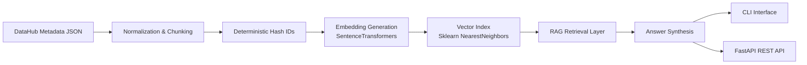

# Metadata RAG Engine

A production-minded metadata AI assistant built in Python to transform DataHub-style schema metadata into a searchable semantic data dictionary using embeddings, vector search, and a local RAG (Retrieval-Augmented Generation) pipeline.

This project reflects how I approach AI systems in enterprise environments — where metadata must be discoverable, deterministic, and operationally reliable.

The goal is not to demonstrate an LLM wrapper, but to model how a real metadata discovery service behaves in production when indexed, queried repeatedly, and exposed via API.

---

## Why This Exists

In most enterprise data platforms:

- Metadata exists but isn’t easily searchable  
- Data dictionaries are incomplete or stale  
- Column-level discoverability is weak  
- Governance and AI initiatives struggle due to lack of semantic context  

This engine bridges that gap by:

- Normalizing raw metadata into structured chunks  
- Generating embeddings for semantic search  
- Performing vector-based retrieval  
- Returning structured, ranked answers via API or CLI  
- Detecting lightweight PII patterns heuristically  

Everything is built with reproducibility and local-first development in mind.

---

## Architecture Overview



---

## End-to-End Flow

Metadata JSON  
→ Normalization & Chunking  
→ Embedding Generation  
→ Vector Index Creation  
→ Semantic Retrieval  
→ Ranked Answer Generation  
→ API / CLI Output  

---

## Project Structure

```
metadata-rag-engine/
│
├── metadata_rag_engine/
│   ├── api/                # FastAPI routes
│   ├── cli/                # Command-line interface
│   ├── core/               # Embeddings, vector store, RAG logic
│   ├── config.py
│   └── logging_conf.py
│
├── data/                   # Sample metadata input
├── tests/                  # Unit tests
├── README.md
├── requirements.txt
├── pyproject.toml
└── LICENSE
```

---

## Features

- Parse DataHub-style metadata JSON  
- Normalize into structured dataset & column chunks  
- Generate semantic embeddings locally  
- Perform cosine similarity search  
- Rank top matching datasets & columns  
- Lightweight PII signal detection (email, phone, SSN, etc.)  
- CLI + REST API access  
- Clean, production-style project structure  

---

## Run Locally

### 1. Create Virtual Environment

```bash
python3 -m venv .venv
source .venv/bin/activate
pip install --upgrade pip
pip install -r requirements.txt
```

---

### 2. Build Vector Index

```bash
python3 -m metadata_rag_engine.cli.main ingest \
  --input data/sample_datahub_metadata.json \
  --outdir .local/index
```

This creates:

```
.local/index/
├── nn.joblib
├── vectors.npy
└── chunks.json
```

---

### 3. Ask via CLI

```bash
python3 -m metadata_rag_engine.cli.main ask \
  --index .local/index \
  --q "Which tables contain customer_id?"
```

---

### 4. Start API

```bash
SCHEMADOC_INDEX=.local/index \
uvicorn metadata_rag_engine.api.app:app --port 8000
```

Open:

```
http://127.0.0.1:8000/docs
```

---

### Example Request

```bash
curl -X POST "http://127.0.0.1:8000/ask" \
  -H "Content-Type: application/json" \
  -d '{"question":"Which datasets contain PII?","top_k":6}'
```

---

## Example Output

```
Top matches for: Which tables contain customer_id?

- postgres:finance.public.customers.customer_id (score=0.446)
- postgres:finance.public.transactions.customer_id (score=0.3905)

PII signals found (heuristic):
- postgres:finance.public.customers.email
```

---

## What This Demonstrates

This project showcases:

- Practical RAG system design  
- Embedding pipeline construction  
- Vector search implementation  
- Deterministic indexing  
- Clean API architecture  
- Local AI infrastructure without cloud dependency  
- Enterprise-oriented metadata thinking  

It is intentionally built without external LLM APIs to demonstrate full-stack AI system ownership.

---

## Future Enhancements

- Plug-in support for local LLMs (Ollama)  
- OpenMetadata / Atlas ingestion adapters  
- Persistent database-backed dictionary  
- Governance rule validation layer  
- Role-based metadata access filtering  
- CI/CD integration for automated indexing  

---

## Author

Built as part of my continued exploration into AI-assisted metadata systems, semantic discovery, and enterprise data platform design.
